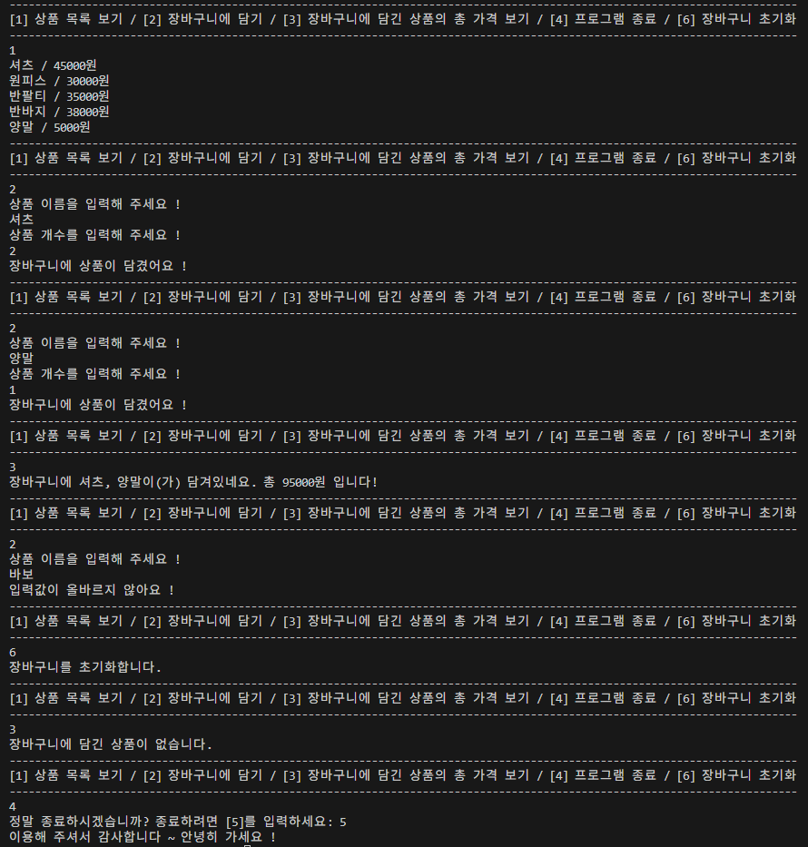

# Project_1 Dart 콘솔 쇼핑몰 애플리케이션
## 프로젝트 소개
이 프로젝트는 Dart언어로 구현된 간단한 콘솔 기반 쇼핑몰 애플리케이션입니다. 

사용자는 상품 목록을 보고, 원하는 상품을 장바구니에 담을 수 있으며, 장바구니에 담긴 상품의 총 가격을 볼 수 있고, 장바구니를 초기화하는 기능이 있습니다.

## 주요기능
- **상품 목록 조회**: 등록된 상품들의 이름과 가격을 확인할 수 있습니다.
- **장바구니 담기**: 원하는 상품을 장바구니에 담을 수 있습니다.
- **총합 금액 확인**: 장바구니에 담긴 상품들의 총합 금액을 확인할 수 있습니다.
- **장바구니 초기화**: 장바구니에 담긴 모든 상품을 비울 수 있습니다.
- **프로그램 종료**: 애플리케이션을 안전하게 종료할 수 있습니다.

## 사용 기술
 

### Dart

## 실행 환경

- Dart SDK 3.5.3
- 콘솔 기반 실행 (예: `dart run`)

## 실행 화면
 

## 프로젝트 구조
- **bin/console_shop.dart**  
  애플리케이션의 메인 진입점입니다.  
  사용자에게 메뉴를 보여주고, 입력에 따라 `ShoppingMall` 클래스의 기능을 호출합니다.

- **lib/shoppingmall.dart**  
  - `Product` 클래스: 상품의 이름과 가격 정보를 관리합니다.  
  - `ShoppingMall` 클래스: 장바구니 기능, 총합 계산 등 애플리케이션의 주요 기능을 구현합니다.
